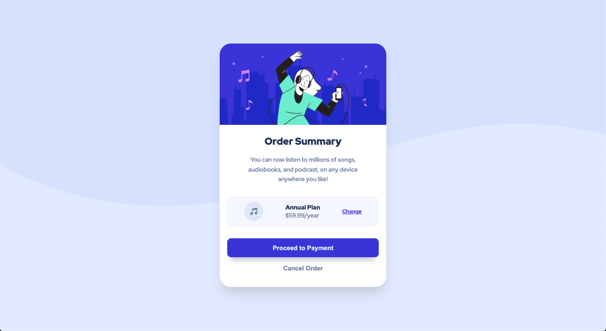
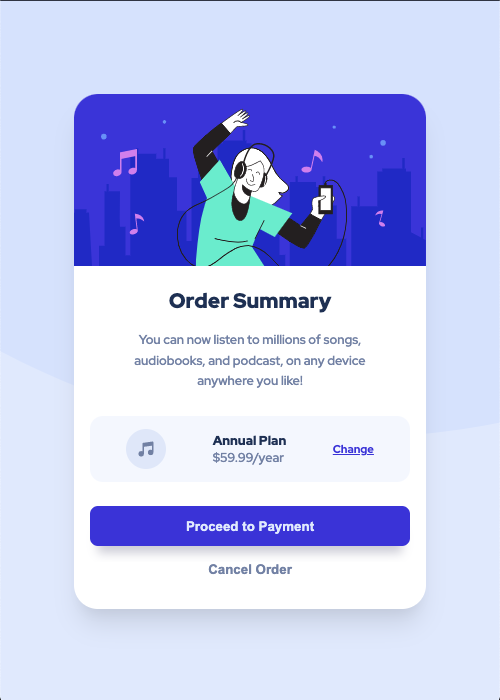

# Make It Real

This is a solution to the Order Summary Card project of the Make It Real course.

## Table of contents

- [Overview](#overview)
  - [The challenge](#the-challenge)
  - [Screenshot](#screenshot)
- [My process](#my-process)
  - [Built with](#built-with)
  - [What I learned](#what-i-learned)
- [Author](#author)
- [Acknowledgments](#acknowledgments)

## Overview

### The challenge

Users should be able to:

- See an optimal design according to the device
- See hover and focus in the interactive elements

### Screenshot

#### Desktop

#### Mobile

## My process

### Built with

- Semantic HTML5 markup
- CSS custom properties
- Flexbox
- React
- Bem
- Mobile-first workflow

### What I learned

How to implement BEM in a react comoponent, import classes in a component and keep practicing
layouts building techniques

## Author

Diego Galeano, Michael Saenz y Jean Vittory
