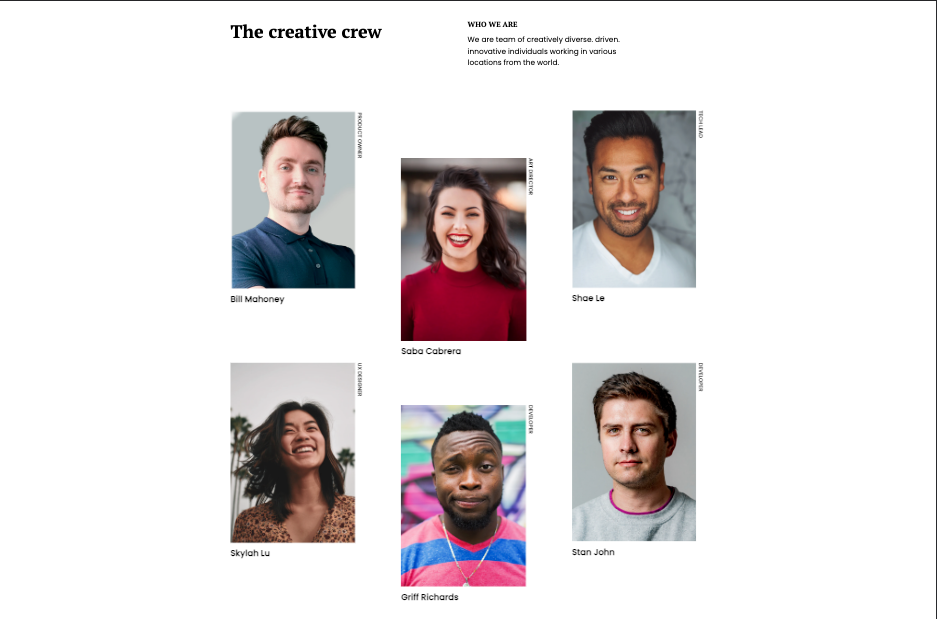
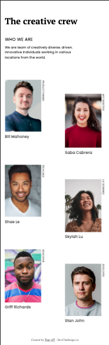

# Make It Real - NAME OF THE PROJECT

This is a solution to the **\_\_\_** project of the Make It Real course.

## Table of contents

- [Overview](#overview)
  - [The challenge](#the-challenge)
  - [Screenshot](#screenshot)
- [My process](#my-process)
  - [Built with](#built-with)
  - [What I learned](#what-i-learned)
- [Author](#author)

## Overview

### The challenge

Users should be able to:

- See the design at 320px to 375px in mobile
- See the design at 376px to 1440px for desktop

### Screenshot

#### Desktop

#### Mobile

## My process

### Built with

- Semantic HTML5 markup
- CSS custom properties
- Flexbox
- Mobile-first workflow

### What I learned

We learned how to implement clamps() in fonts to make them more responsiveness. The layout improve
our ability with flex and grid

## Author

Jean Vittory, Michael Saenz & Camilo Gil
