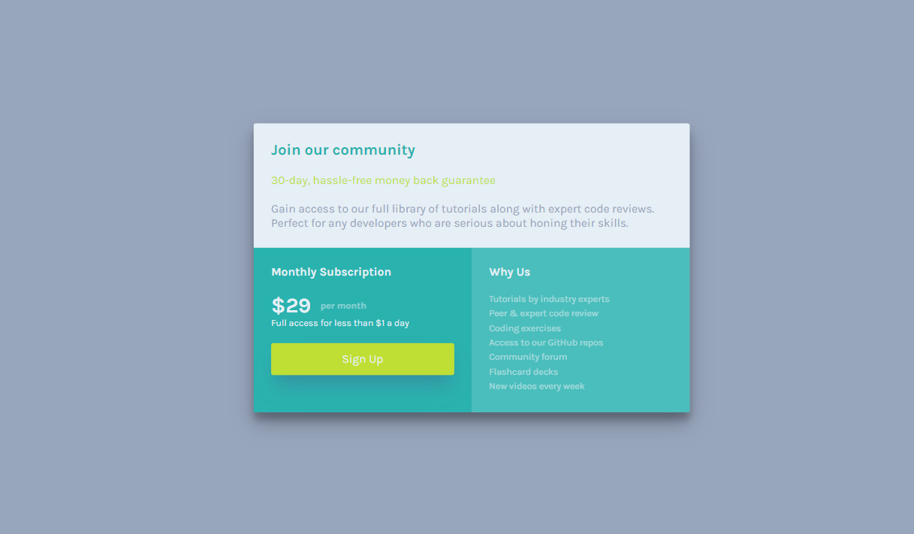

# Single Price Grid Component

Esta es una solución al proyecto **Single Price Grid Component** del curso Make It Real.

## Tabla de contenido

- [Single Price Grid Component](#single-price-grid-component)
  - [Tabla de contenido](#tabla-de-contenido)
  - [Resumen](#resumen)
    - [El reto](#el-reto)
    - [Captura de pantalla](#captura-de-pantalla)
  - [Mi proceso](#mi-proceso)
    - [Construido con](#construido-con)
    - [Lo que aprendí](#lo-que-aprendí)
    - [Desarrollo continuo](#desarrollo-continuo)
    - [Recursos útiles](#recursos-útiles)
  - [Autor](#autor)

## Resumen

El reto consiste en generar, mediante HTML y CSS, una pagina que muestre una tarjeta con 3
divisiones, en cada division se debe mostrar un texto explicativo, ademas, en la segunda division
debe existir un botón de registro.

### El reto

Los usuarios deben ser capaces de:

- visualizar el componente anteriormente descrito, este componente debe ser responsivo, generando
  una visualización móvil para dispositivos cuyo ancho sea inferior a 375 pixeles y otra
  visualización para dispositivos con pantallas mas grandes

### Captura de pantalla

Dispositivo móvil

Dispositivo de escritorio

## Mi proceso

- Identificar los diferentes contenedores de elementos HTML
- generar la estructura de la pagina con HTML haciendo énfasis en el contenido que debe tener cada
  contenedor
- crear la hoja de estilos CSS y usando la herramienta FlexBox generar los estilos correspondientes
  para dispositivos de hasta 375 pixeles de ancho
- crear una MediaQuery que modifique los estilos creados anteriormente para generar el contenido de
  un dispositivo de escritorio

### Construido con

- Marcado HTML5
- Propiedades personalizadas de CSS
- FlexBox
- Flujo de trabajo móvil primero

### Lo que aprendí

En este reto aprendimos a utilizar algunas propiedades del modulo de flexBox para posicionar
elementos de forma sencilla.

### Desarrollo continuo

Es de gran importancia seguir profundizando en en la metodologia de trabajo BEM

### Recursos útiles

- [ CSS-TRICKS ](https://css-tricks.com/snippets/css/a-guide-to-flexbox/): Este recurso nos mostró
  como utilizar de forma correcta las propiedades de FlexBox vistas anteriormente.
- [ANIMATICSS](https://animaticss.com/articulo/que-es-bem-css/): Este recurso muestra en que
  consiste la metodología BEM

## Autor

- Adrian Camilo Gil
- Jean Vittory
