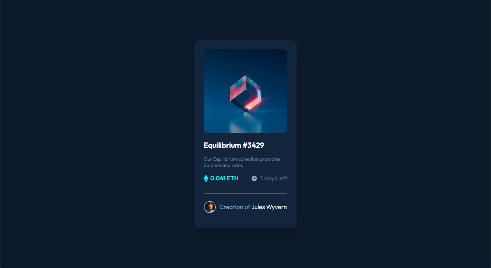
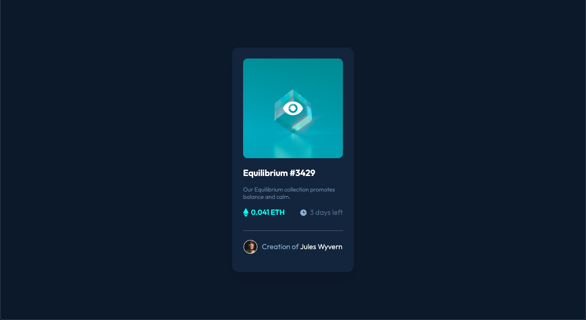
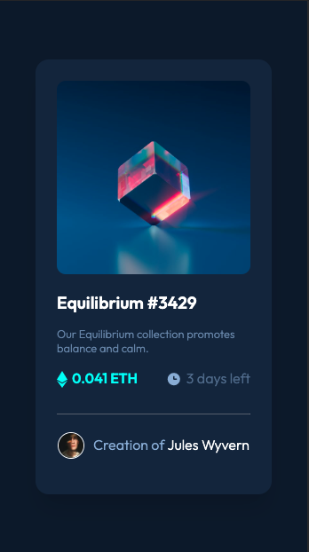

## Table of contents

- [Overview](#overview)
  - [The challenge](#the-challenge)
  - [Screenshot](#screenshot)
- [My process](#my-process)
  - [Built with](#built-with)
  - [What I learned](#what-i-learned)
- [Author](#author)

## Overview

### The challenge

Users should be able to:

- View the design from 375px below
- View the application in 376px and above for desktop

### Screenshot

#### Desktop

#### Desktop w/ hover

#### Mobile

## My process

### Built with

- Semantic HTML5 markup
- CSS custom properties
- Flexbox
- Mobile-first workflow

### What I learned

We enforce our abilities to understand pseudo-class and the insertion of images through css

## Author

Jean Vittory & Diego Galeano
