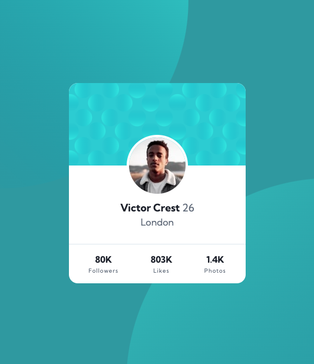

# Make It Real - NAME OF THE PROJECT

This is a solution to the Profil card component project of the Make It Real course.

## Table of contents

- [Overview](#overview)
  - [The challenge](#the-challenge)
  - [Screenshot](#screenshot)
- [My process](#my-process)
  - [Built with](#built-with)
  - [What I learned](#what-i-learned)
  - [Continued development](#continued-development)
- [Author](#author)

## Overview

### The challenge

Adapt the background to the all devices and translate the card design to code

### Screenshot

#### Desktop

#### Mobile

## My process

### Built with

- Semantic HTML5 markup
- CSS custom properties
- BEM
- Flexbox

### What I learned

Get familiar with vmin to calculate element sizes taking viewport size into account allowing us to
scales the background better on all devices.

### Continued development

Get more practice with vmin and adptative backgorunds

## Author

Nicolás Rodriguez, Diego Galeano, Jean vittory
